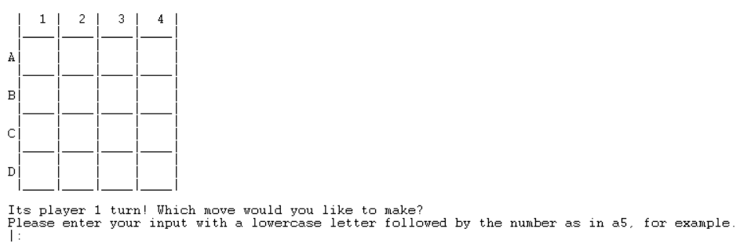
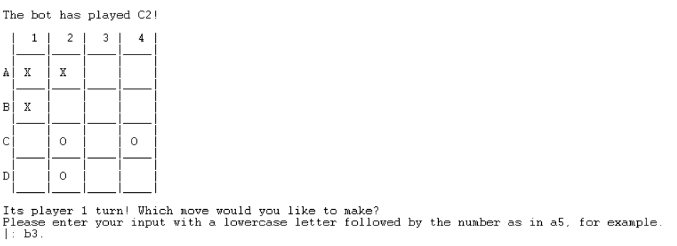
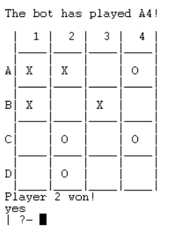

# **Snort - Trabalho Prático 2**

Contextualização e explicação do projeto desenvolvido na unidade curricular de Programação Funcional em Lógica.

---

## **Identificação**

Grupo 506, 22/01/2022

* João Afonso Martins Domingues Andrade, up201905589@up.pt, Contribuição: 50%
* Sérgio Miguel Rosa Estêvão, up201905680@up.pt, Contribuição: 50%

## **Instalação e Execução**

### **Dependências**

* SICStus - [Download](https://sicstus.sics.se/eval.html)

* Código Fonte - [Source Code on Git Hub](https://github.com/SergioEstevao11/Snort)

### **Execução do Jogo**

* Windows: Abrir o terminal SICTsus.

* Linux: Podemos executar o programa SICTsus com o comando *../sicstus/bin* sendo *..* o caminho até o diretório sicstus.

### **Começar o jogo**

Para conseguirmos corretamente jogar Snort temos primeiro de, consultar o código fonte apresentado no GitHub acima apresentado (ficheiro snort.pl) e de seguida executar a função *play_game.*

## **Descrição do jogo:**   

O SNORT é um jogo de tabuleiro criado por Simon Norton em 1970, tendo o seu nome origem no nome do seu criado (Simon NORTon).
 
O SNORT é jogado num tabuleiro quadrado dividido em quadrados mais pequenos vazios (estado inicial), tendo este tabuleiro tamanho escolhido pelo utilizador entre 4x4 e 9x9. 

Dois jogadores, sendo simbolizados pelos símbolos 'X' e 'O', tomam turnos em que podem colocar uma peça num quadrado que esteja vazio (sendo que não é permitido colocar num quadrado que seja ortogonalmente adjacente a um quadrado já ocupado por uma peça inimiga).

O jogo termina quando já não existem quadrados disponíveis para realizar uma jogada, ganhando aquele que for o último jogador a colocar uma peça.

## **Lógica do jogo**

### **Representação Interna do Estado de Jogo**

O estado de jogo durante a execução do programa é representado por uma lista de listas, sendo que o valor de cada quadrado pode ser um dos seguintes:
 * ' '  ->  um espaço vazio se o quadrado estiver vazio;
 * 'X'  ->  se o quadrado estiver ocupado pelo jogador 1;
 * 'O'  ->  se o quadrado estiver ocupado pelo jogador 2.

O jogador atual, durante a execução do jogo assume os valores 1 ou 2.

### **Estados de jogo**

* Estado inicial do jogo

* Estado do jogo após algumas jogadas

* Estado final do jogo

### **Visualização do estado de jogo**

* **Tabuleiro**

A visualização do jogo é realizada através da utilização das seguintes funções:

- `display_game(+Board)`  
- `drawBoardBody(+Board,+Length,+Rows)`  
- `drawRowSepparation(+Length)`  
- `drawValue(+Board, +Length, +Row)`
- `drawRow(+Length)`  
- `drawBoardTop(+Length)`  
- `drawCollumIds(+Length,+LengthLeft)`

A função principal que trata de todo o display do board é a função display_game que chama as funções drawCollumnIds, drawBoardTop e drawBoardBody.

A função drawCollumnIds é utilizada para desenhar no ecrâ os índices de cada uma das colunas.

A função drawBoardTop é responsável para desenhar no ecrâ o limtite superior do tabuleiro.

Posteriormente é chamada a função drawBoardBody que chama todas as outras funções restantes e é responsável pelo desennho do body do tabuleiro.

A função drawRowSepparation desenha a separação entre rows de forma a tornar o board mais apelativo.

A função drawValue é a função responsável por desenhar no ecrâ os valores correspondentes às peças que estão colocadas em certa posição do tabuleiro.

Por fim a função drawRow desenha a separação principal entre cada uma das linhas do tabuleiro.

* **Menus**

Ao executarmos a função principal do jogo é nos apresentado o menu inicial que apresenta 4 opções:
* Begin game que mostra o menu de jogo
* Rules que apresenta as regras principais do jogo
* About Us que mostra ao utilizador algumas informações sobre o trabalho e os seus autores
* Exit Game que permite ao utilizador sair do  jogo, acabando a execução    

Ao escolhermos a opção 1 é nos apresentado o menu de jogo que apresenta 2 opções:
* Player vs Player que permmite ao utilizador jogar contra outro jogador
* Player vs Bot que permite ao utilizador jogar contra um Bot

As páginas Rules e About Us têm apenas a opção de voltar para trás.

O input dos utilizador é devidamente tratado, tanto no input dos utilizador na escolha de opções nos menus como também na escolha de uma jogada.

Se houver erro no input é chamada a função invalidInput que mostra uma mensagem de erro ao utilizador e manda um fail ( que dá trigger ao repeat ), permitindo ao utilizador voltar a tentar.

### **Execução de jogadas**

### **Final de jogo**

### **Lista de Jogadas Válidas**

### **Conclusões**
  
Este trabalho permitiu-nos de certa forma termos um contacto diferente com a linguagem PROLOG sendo que nos permitiu observar de uma forma mais prática e divertida (na realização de um jogo) as aplicações diferentes que esta linguagem pode ter.

As maiores dificuldades que encontramos foram no tempo reduzido que tivemos para a realização do trabalho visto que se trata de uma época bastante carregada de projetos às diferentes cadeiras.

No entanto, foi nos bastante satisfatório ver o progresso do jogo que desenvolvemos.

Alguns aspetos a melhorar:
* Implementação de um bot melhorado que não realize todas as jogadas random
* Implementação de menus e estados de jogo mais apelativos
* Melhoramentos em geral na estética de jogo 

### **Bibliografia**
[BoardGameGeek](https://boardgamegeek.com/boardgame/151888/snort)  
[Documentação do SICStus](https://sicstus.sics.se/sicstus/docs/latest4/html/sicstus.html/)  
[Aulas de Programação em Lógica](https://moodle.up.pt/course/view.php?id=4031)  
